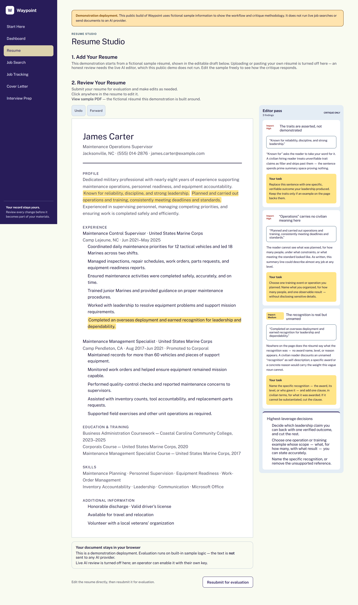
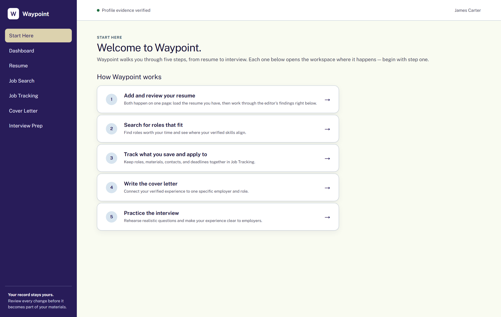
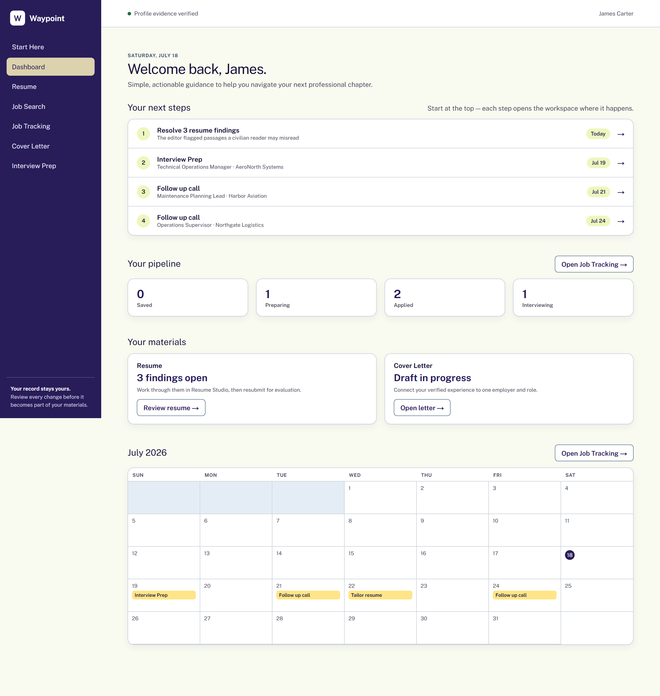
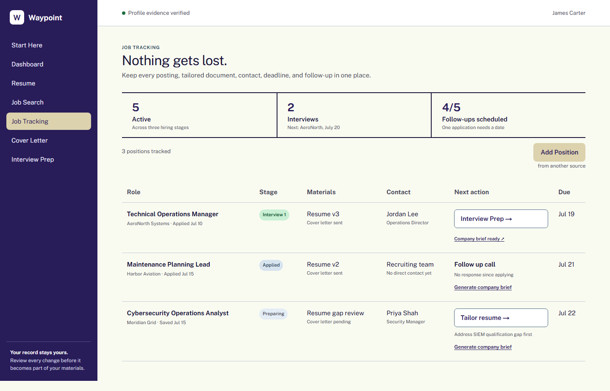

# Waypoint

**An AI career-transition workspace for veterans that refines service records into civilian-ready assets.** Editors, not ghostwriters: every finding cites its evidence and is editable in the app. Craft a resume, search for jobs, write a cover letter, practice for interviews and track each step toward a new career.

Every year, roughly 200,000 U.S. service members leave the military and run into the same wall: their experience is real, but their language doesn't translate. "Maintained a 96% MC rate" means nothing to a civilian recruiter. Generic AI tools "fix" this by ghostwriting — replacing the veteran's record with fluent text they can't defend in an interview. Waypoint takes the opposite bet.

## Competition Entry

- **Cohort:** Technical
- **Domain:** Military-to-Civilian Resume Editor for Recently Separated Enlisted Marines
- **Client brief:** [`brief.md`](brief.md)
- **Standalone editor folder:** [`stages/01_resume/references/`](stages/01_resume/references/)
- **Supporting evidence:** The rest of Waypoint demonstrates the same folder system running inside a deployed application.



## The editor — portable and deployed

**[`stages/01_resume/references/`](stages/01_resume/references/) is the Military-to-Civilian Resume Editor** — five files, one job each: `identity.md` · `rules.md` · `examples.md` · `reference/` · `README.md`. Drop the folder into a Claude project and Claude becomes the editor: paste a resume, get back at most seven prioritized findings, each quoting the exact resume text, explaining how a civilian hiring reader will misread it, and assigning a bounded revision task. Never a rewrite — the folder's [README](stages/01_resume/references/README.md) has the two-minute setup.

And the folder isn't just portable — **it's deployed.** Everything below is Waypoint, a working career-transition workspace where this exact markdown is assembled into the live AI editor's prompt on every request — findings highlight in the document, runs are logged to the stage's `output/`, and two sibling editors (cover letter, interview response) follow the same five-file shape in their own stages.

## The principle: critique, never ghostwrite

Every editor in Waypoint follows the same contract:

- **Findings quote their evidence.** Each finding cites the smallest exact passage that has a problem — and the workspace highlights it in the document.
- **Reasoning is shown, not asserted.** Every finding explains how a civilian hiring reader will interpret the passage, and why that costs the veteran.
- **Tasks, not rewrites.** The editor assigns a bounded revision task. The veteran makes the edit, in their own words, and resubmits. Nothing is ever changed for them.
- **No invented facts.** Editors never add scale, outcomes, credentials, or company knowledge the record doesn't support — the goal is a resume the veteran can defend in the interview, not one that merely reads well.

## Interpretable by design (ICM)

Waypoint is built on the **Interpretable Context Methodology** (Van Clief & McDermott, arXiv:2603.16021). The AI's entire "mind" is plain, human-editable markdown:

```
stages/
├── 01_resume/        CONTEXT.md · references/ (identity, rules, review framework, examples) · output/
├── 02_job_search/    CONTEXT.md · references/ · output/
├── 03_job_tracking/  CONTEXT.md · references/ (incl. the company-brief writer's rules) · output/
├── 04_cover_letter/  CONTEXT.md · references/ (incl. the in-app example letter) · output/
├── 05_applications/  CONTEXT.md · references/ · output/
└── 06_interview/     CONTEXT.md · references/ (incl. the 0–4 response rubric) · output/
```

The app assembles each editor's prompt **from these files at request time** and writes every AI run to the stage's `output/` as diffable JSON. Edit `stages/01_resume/references/rules.md` and the resume editor behaves differently — no code change, no redeploy, full git history of who changed the editor's judgment and when. Even the cover-letter example shown in the app is a markdown file in its stage.

### ICM foundation

Audited against the six-area ICM rubric — root layers, stage folders, stage internals, contracts, chaining, layer discipline — with **4/4 in every area**. Full log with history and resolved findings: [`ICM-AUDIT-LOG.md`](ICM-AUDIT-LOG.md).

- **The handoffs are real files.** The tracker materializes its state into stage outputs on every change — `saved-roles.json` (02) → `tracked-roles.json` (03) → `applications.json` (05) — so the chain declared in the contracts exists as diffable, human-editable artifacts. Save a job in the app and `git diff` shows it.
- **Every AI run is logged.** Resume, cover letter, and interview critiques land in their stage's `output/`; each generated company brief lands in stage 03's.
- **The stages work without the app.** Each contract documents a canonical drop-file path for per-run input, so a headless agent can flow through the pipeline stage by stage.

## The journey

A five-step path from service record to job offer, with one workspace per step:



| Step | Workspace | What happens |
|------|-----------|--------------|
| 1 | **Resume Studio** | Upload or paste a resume; the editor returns evidence-quoted findings; edit in place and resubmit until clear |
| 2 | **Job Search** | Find roles and see fit as evidence, not a verdict |
| 3 | **Job Tracking** | Saved roles and applications in one tracker — stage, materials, contacts, a clickable next action per row, and an AI-generated company brief per position |
| 4 | **Cover Letter** | Draft against a critique-only editor; a strong finished example is one click away |
| 5 | **Interview Prep** | Practice responses scored 0–4 on relevance, ownership, evidence, and translation |

The dashboard ties it together: prioritized next steps, live pipeline counts, materials status, and a month calendar of due dates.



Job Tracking is the operational center: every saved role and application in one table — stage, materials, contacts, and due dates — where each next action clicks through to the workspace it needs, and any position can generate its own AI company brief on demand.



More: [Job Search](docs/screenshots/job-search.png) · [Cover Letter](docs/screenshots/cover-letter.png) · [Interview Prep](docs/screenshots/interview-prep.png)

## The AI layer

The editors are Claude. `POST /api/critique/[stage]` (resume · cover-letter · interview) assembles its system prompt from the stage's ICM references plus shared ground rules and calls Claude with a strict JSON schema — findings must be verbatim substrings of the submitted text, which is what makes in-document highlighting reliable. If the API is ever unreachable, the app degrades to offline demo evaluators so nothing breaks — and those results are **clearly labeled as demo findings** in the UI. The demo is a resilience layer, not a mode.

The same pattern powers `POST /api/brief`: a pre-interview **company brief** for any tracked position, written under the honesty rules in `stages/03_job_tracking/references/brief-guide.md` — no invented company facts (it says what to verify instead), fit claims drawn only from the candidate's actual resume, and every brief ends with one honest gap and how to address it plainly. Briefs have no fabricated fallback — fake research would break the product's core promise.

## Quickstart

```
npm install
cp .env.example .env.local    # set ANTHROPIC_API_KEY — the editors are Claude-powered
npm run dev                   # http://localhost:3000
```

Verification: `npm run lint` · `npm run build`. Without a key the app still runs, with editors showing clearly-labeled demo findings.

## Grounding and boundaries

MOS-to-career mappings are treated as hypotheses, never proof of experience. Production sources should prioritize O*NET, My Next Move for Veterans, Department of Labor resources, Marine Corps COOL, official employer postings, and company primary sources, accessed through permitted APIs or user-provided postings. The interview methodology uses general, independently established principles: identify the employer's underlying need, provide defensible evidence, make individual judgment visible.

## Privacy

Do not upload classified, controlled, export-restricted, medical, or unnecessary personally identifying information. A production release requires authentication, encrypted storage, retention controls, deletion, and access logs. The app stores drafts and tracker data in this browser, and uploaded files are parsed locally. When you press an AI-review control, the relevant text is sent to the configured hosted AI provider and the result returns to the browser. Remove Social Security and service numbers, home addresses, medical information, classified or controlled information, and unnecessary personal details before submitting.

## Accessibility: WCAG 2.2 AA — audited, fixed, verified

Accessibility is a stated product requirement, not a checkbox. The app was audited with **axe-core across every page** (WCAG 2A/AA/2.2 AA rulesets) plus a manual checklist pass, and every finding was fixed and re-verified in a live browser:

- Zero axe violations on all pages; skip-to-content link as the first focusable element on every page
- Visible 3px focus rings, full keyboard operability, `prefers-reduced-motion` support, and status announcements (`role="status"`) for evaluations, toasts, and fallback notices
- 4.5:1+ contrast throughout, including form placeholders; rem-based type so browser text scaling works
- 44px touch targets per the product spec (one documented exception: the intentionally compact Undo/Forward controls)
- Per-page titles, correct heading hierarchy, labeled table headers, and screen-reader labels on calendar events

## Built for real use

- **Your work survives.** The resume draft, editor findings, cover letter, interview answer, and the whole tracker persist in the browser (localStorage) — no account needed. Only text submitted through an AI-review action is sent to the configured hosted provider.
- **Real job listings.** Job Search connects to the **USAJOBS API** — federal hiring, where veterans' preference actually applies (free key at developer.usajobs.gov). Without credentials, clearly-labeled sample roles keep the page fully functional.
- **Any resume file.** PDF, DOCX, TXT, MD, RTF, or pasted text — parsed entirely in the browser (pdf.js + mammoth), so the file never leaves the machine.
- **Manual tracking.** Add positions directly in Job Tracking alongside roles saved from search; every next action links to the workspace where it happens.
- **Company briefs on demand.** One click per tracked position generates a five-section pre-interview brief — who they are, what the role owns, why *your* record fits, likely questions, and one honest gap — viewable in its own tab and logged to the ICM stage.

Roadmap: accounts and cloud sync, additional job boards.
