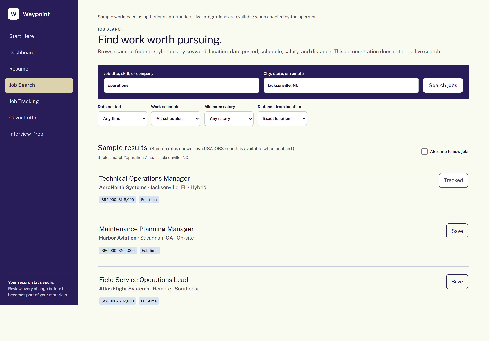

# Waypoint

**A critique-only resume editor for veterans entering civilian careers — and the career-transition workspace built around it.**

**An AI career-transition workspace that helps veterans refine their service records into civilian-ready assets.**

More than 200,000 U.S. service members transition to civilian life each year.[^1] Their experience is real; the problem is that military language often does not translate. Acronyms, broad leadership claims, and unclear scope can keep civilian employers from seeing what someone actually did.[^2]

Many AI tools respond by rewriting the résumé. Waypoint takes the opposite approach. It identifies the exact wording that may confuse a civilian reader, explains the impact, and gives the veteran a bounded revision task without supplying replacement prose. The veteran remains the author and the authority on every fact.

## Scope

| | |
|---|---|
| **Primary focus** | Helping veterans translate verified military experience into civilian-ready résumés without losing ownership of the facts or the writing |
| **Standalone editor** | A portable military-to-civilian résumé editor in [`stages/01_resume/references/`](stages/01_resume/references/) |
| **Connected workflow** | Résumé review, job search, job tracking, cover-letter critique, interview practice, and a dashboard that keeps the process organized |
| **Built for live use** | AI-powered critique and company briefs, live federal job search, and résumé upload or paste when enabled by the operator |

> **Demo note:** The public version uses fictional sample data to show the full workflow.

## Critique, never ghostwrite

Every Waypoint editor follows the same contract:

- **Quote the evidence.** Each finding points to the smallest exact passage with a problem.
- **Explain the civilian impact.** The editor shows how the wording may be understood and why it matters.
- **Give a task, not a rewrite.** The veteran decides how to revise it.
- **Do not invent facts.** No added scale, outcomes, credentials, or unsupported company knowledge.
- **Keep the review bounded.** Résumé critiques return no more than seven prioritized findings, followed by up to three highest-leverage decisions.


## The connected workflow

Waypoint guides veterans through five connected steps:

| Step | Workspace | What happens |
|---|---|---|
| 1 | **Resume Studio** | Review evidence-quoted findings, edit the résumé in place, and resubmit |
| 2 | **Job Search** | Explore sample federal-style roles or search live federal listings when enabled |
| 3 | **Job Tracking** | Keep saved roles, applications, contacts, materials, due dates, and next actions together |
| 4 | **Cover Letter** | Draft against a critique-only editor without turning the letter into generic AI prose |
| 5 | **Interview Prep** | Practice responses scored on relevance, ownership, evidence, and translation |

The dashboard brings the workflow, application pipeline, materials, and deadlines into one view.




## Built for live use

Waypoint is wired for:

- AI-powered résumé, cover-letter, and interview critique
- AI-powered company briefs
- live federal job search
- résumé upload and paste

Live integrations are opt-in and require operator-supplied credentials. Configuration details are documented in [`.env.example`](.env.example).

> **Demo note:** The public version uses fictional sample content. Resume Studio demonstrates the review process with seeded passages, Job Search uses sample roles, and company briefs are not generated from invented research.

## Interpretable by design

Waypoint follows the Interpretable Context Methodology. The editor’s identity, rules, examples, and review framework live in plain Markdown instead of one hidden prompt.

- `identity.md` defines the editor.
- `rules.md` defines its boundaries.
- `review-framework.md` defines the review sequence.
- `examples.md` shows what acceptable output looks like.

The app loads those files in a defined order when it builds the editor instructions. Changing a rule changes the editor’s behavior while keeping the instruction visible and version-controlled.

The standalone résumé editor is available in [`stages/01_resume/references/`](stages/01_resume/references/).

## Run locally

```bash
npm install
npm run dev
```

Open `http://localhost:3000`.

The sample experience requires no configuration. To enable live integrations, copy `.env.example` to `.env.local` and add the required credentials. Never commit real keys.

Verification:

```bash
npm test
npm run test:a11y
npm run lint
npm run build
```

## Privacy and boundaries

Drafts and tracking data are stored in the browser. In the public sample, nothing is sent to an external AI provider. When live AI is enabled, only text submitted for review is sent to the configured provider.

Do not submit Social Security or service numbers, home addresses, medical information, classified material, controlled information, export-restricted information, or anything unnecessary for the review.

Waypoint does not guarantee employment, applicant-tracking-system ranking, civilian credential equivalence, or clearance transferability.

## Sources

[^1]: [U.S. Department of Labor — Transition Assistance Program](https://www.dol.gov/agencies/vets/programs/tap)
[^2]: [U.S. Government Accountability Office — Military and Veteran Support: Performance Goals Could Strengthen Programs That Help Servicemembers Obtain Civilian Employment](https://www.gao.gov/products/gao-22-105261)
